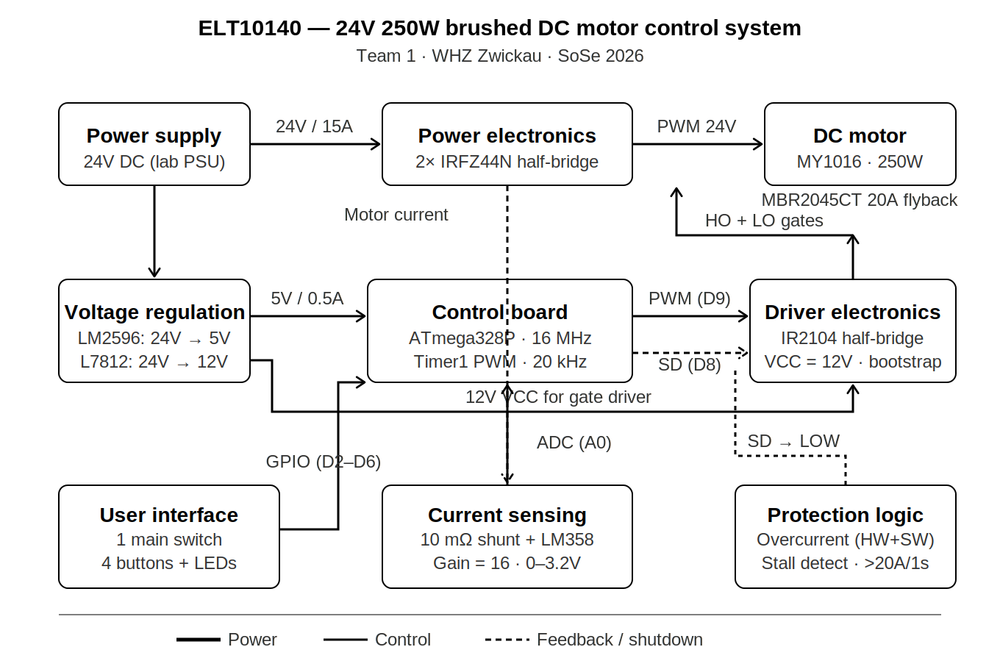

# ELT10140 – Electric Drive Systems | WHZ Zwickau SoSe 2026

## 24V 250W Brushed DC Motor Driver — Team 1

A complete control system for the **MY1016 24V 250W brushed DC motor**, designed and built as part of the ELT10140 practical course at Westsächsische Hochschule Zwickau.

### System Overview

| Block | Key Components |
|-------|---------------|
| **Power Supply** | LM2596 buck (24V→5V), L7812 linear (24V→12V) |
| **Gate Driver** | IR2104 half-bridge driver with bootstrap circuit |
| **Power Stage** | 2× IRFZ44N N-channel MOSFETs (half-bridge topology) |
| **Protection** | MBR2045CT freewheeling diode, 10mΩ shunt + LM358 current sense (gain=16), hardware overcurrent shutdown |
| **Control** | ATmega328P — 20kHz Fast PWM, soft-start, stall detection, state machine |

### Block Diagram



### Repository Structure

```
├── design/          # Technical design documents & guides
│   ├── Complete_24V_250W_Brushed_DC_Motor_Driver_Design_*.md
│   ├── ATmega328P_Motor_Control_*.md
│   └── Proteus_BUTTON_*.md
├── docs/            # Course documents, project requirements
│   ├── Practical_Course_ELT10140___Project_Requirements*.pdf
│   ├── Practical_Course_ELT10140___Project_Hints.pdf
│   └── la_whz_*.pdf
└── images/          # Diagrams and schematics
```

### Key Design Decisions

- **IR2104 requires 12V VCC** — the 8.2V UVLO threshold makes 5V operation impossible; a dedicated L7812 regulator is mandatory.
- **Half-bridge topology** with synchronous rectification via Q2 channel (17.5mΩ) is significantly more efficient than a low-side switch + flyback diode.
- **Dual-layer overcurrent protection** — hardware comparator on SD pin (sub-µs response) + software stall detection (>20A for >1s).
- **20kHz PWM** eliminates audible noise while keeping switching losses under 0.35W per MOSFET.

### Tools

- **Simulation:** Proteus 9 Professional
- **PCB Design:** KiCad (2-layer, 2oz copper)
- **Firmware:** ATmega328P via PlatformIO / Arduino framework

### Course Info

- **Course:** ELT10140 – Electric Drive Systems, SoSe 2026
- **University:** Westsächsische Hochschule Zwickau (WHZ)
- **Supervisors:** Prof. Dr.-Ing. Zitzelsberger, Prof. U. David, Prof. R. Lehmann

---

*Team 1 — ELT10140 Electric Drive Systems*
